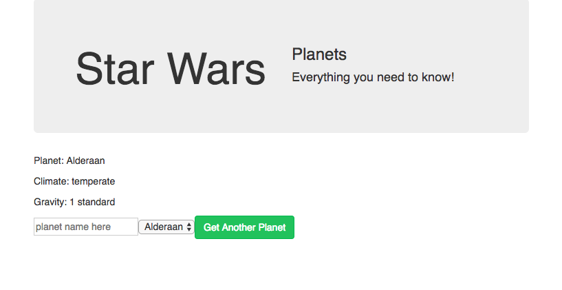

# Star Wars Info
## Using React + Redux + API
### Grabbing data from cloud-based API source
#### March 27 - April 12, 2018
#### Maker: [David Eliason](http://www.davethemaker.com)

### Goal:

Build react + redux infrastructure to display info.
Behind the scenes, grab data from API. 

[Return to Portfolio](https://davideliason.github.io/)

[Heroku Hosted](https://polar-shelf-77447.herokuapp.com/)

### Learning Mission:

Working with cloud-based data is an important conceptual piece of a bigger project that I'm working on for Maker's Faire, called [IoT Empoering Me](http://www.mysticmonklabs.com/iotempoweringme) - an IoT + App product to empower individuals within the community.

- Version one with be front-end UI emphasis.
- Version two will be for building a Native app.
- Version three will tie in data persistence, possible routing using express and node.

### Practicuum:

1. use create-react-app for template app structure
2. [Add CRA to Heroku](https://gist.github.com/mars/5e01bb2a074594b44870cb087f54fe2f)
3. [Heroku live](https://polar-shelf-77447.herokuapp.com/)
4.  Use Postman to get a sample API Get Call and figure out which datapoints to access in fetch calls
5. add Bootstrap and UI rendering of data as well and input fields

#### Redux
6. add redux, react-redux, redux-logger, redux-thunk
7. File structure: add parent common folder, with these sub-folders: redux (actions, reducers) and containers.
7.1 create appContainer to wrap App component
7.2 create store using rootReducer and applying middleware

Action Shot! 

